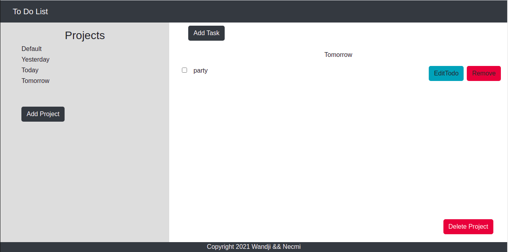
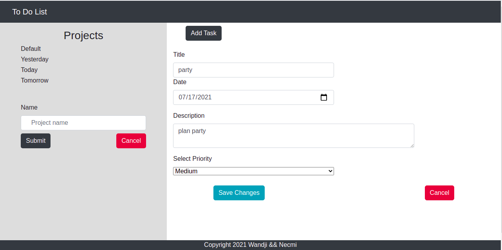

# Todo-list

A simple Todo app where a user can:

- Create Projects
- Create Todos for each project
- Edit Todos
- Remove Projects or Todos

## Built With

- JavaScript
- HTML
- CSS
- Webpack
- Bootstrap

## Getting Started

To set up a local copy of the project

- `git clone git@github.com:verissimohenry/to-do-list.git`
- `cd to-do-list`
- `npm install`

To test the app

- run `npm test`

## Usage

double click on  `dist/index.html` to open project in new browser window

## AUTHOR

👤 **Verissimo Henry**

- Github: [@githubhandle](https://github.com/verissimohenry)
- Twitter: [@twitterhandle](https://twitter.com/verissimohenry)
- Linkedin: [linkedin](https://www.linkedin.com/in/henry-verissimo-618906167/)
- Email: verissimohenry04@gmail.com

## 🤝 Contributing

Contributions, issues, and feature requests are welcome!

## Show your support

Give a ⭐️ if you like this project!

## Acknowledgments

- [Odin Projects](https://www.theodinproject.com/courses/)
- [Microverse](https://microverse.com)

## 📝 License

This project is [MIT](https://mit-license.org/) licensed.
